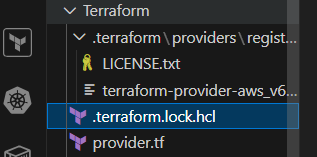

### In this repo we will understand how terraform functions 

we can execute the terraform commands, if we have the .tf files

Once, if we write a provider.tf file and do perform a terraform init command it will start creating the files shown in the above image like LICENSE.txt  , .terraform  ,  .terraform.lock.hcl  etc which will have all the details about the terraform its provider version etc

https://registry.terraform.io/providers/hashicorp/aws/latest/docs/resources  >> is the link from where we can create the resources

if you are creating a resource, it gives us o/p using this we can create other resources. So, we use its id and create the other resources

## Variables

    There are multiple ways for variabilising in terraform

    1. command line
        terraform plan -var "sg_name=cmd-allow-all"  (here variable mentioned the command line overrides the values which are mentioned in the .tf files)
    2. tfvars
        terraform plan (this will override the values which are mentioned in the .tf files)
    3. env variables
        export TF_VAR_sg_name=env-allow-all   (we have to set an env value)
        terraform plan
    4. default values
        if we comment the tfvars.tf and unset the env variables start creating a resource, the variables are read from the default values
    5. user prompt
        if we comment the tfvars.tf and unset the env variables and no default vars are present and start creating a resource, then terraform will ask for the user input for a variable-name

     command line >> tfvars >> env variables >> default values  >> user prompt  (this is the hierarchy)