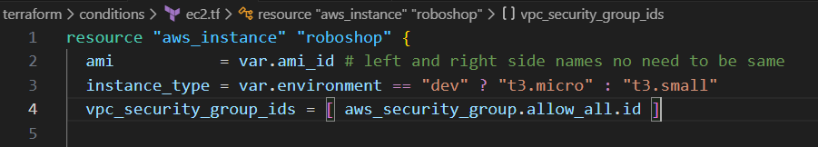
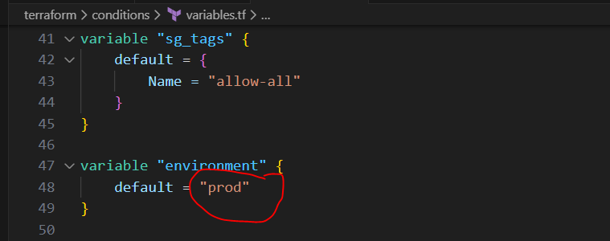
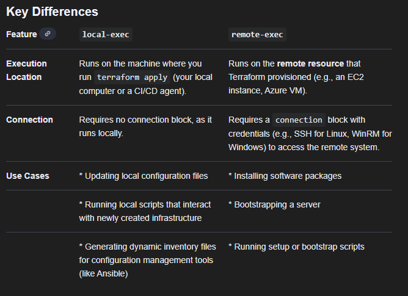

### In this repo we will understand how terraform functions 

we can execute the terraform commands, if we have the .tf files

Once, if we write a provider.tf file and do perform a terraform init command it will start creating the files shown in the above image like LICENSE.txt  , .terraform  ,  .terraform.lock.hcl  etc which will have all the details about the terraform its provider version etc

https://registry.terraform.io/providers/hashicorp/aws/latest/docs/resources  >> is the link from where we can create the resources

if you are creating a resource, it gives us o/p using this we can create other resources. So, we use its id and create the other resources

## Variables

    There are multiple ways for variabilising in terraform

    1. command line
        terraform plan -var "sg_name=cmd-allow-all"  (here variable mentioned the command line overrides the values which are mentioned in the .tf files)
    2. tfvars
        terraform plan (this will override the values which are mentioned in the .tf files)
    3. env variables
        export TF_VAR_sg_name=env-allow-all   (we have to set an env value)
        terraform plan
    4. default values
        if we comment the tfvars.tf and unset the env variables start creating a resource, the variables are read from the default values
    5. user prompt
        if we comment the tfvars.tf and unset the env variables and no default vars are present and start creating a resource, then terraform will ask for the user input for a variable-name

     command line >> tfvars >> env variables >> default values  >> user prompt  (this is the hierarchy)

## Conditions

In the above image, lino-3 has a condition. And its concerned variable is mentioned in the variables.tf file as shown below
If that condition is true it will take the t3.micro else it will take t3.small for creating an instance

Do terraform terraform plan and we can understand what is being picked

## Loops

    1. count based loops

        if we just use count = 4 under any resource, then a resource with same name will be created four times
        if we use this tag Name = var.instances[count.index], it will take the count from variables.tf file and creates the no of resorces depending on the names mentioned in the variables.tf
    
        tags = {   
            Name = var.instances[count.index]
                }

        variable "instances" {
            default = ["mongodb", "redis", "mysql", "rabbitmq"]
            }

        If we want to create a route53 record using the privateIP which gets created via ec2 resource, we should right the output.tf for the ec2 instance and use it

        1. if you have list, go for count under resource
        2. if you have map or set, go for for each under resource

    2. For loop

## Dynamic Blocks

    dynamic blocks
    ================
            dynamic ingress {
                for_each = var.ingress_ports
                content {
                    from_port        = ingress.value["from_port"]
                    to_port          = ingress.value["to_port"]
                    protocol         = "-1"
                    cidr_blocks      = var.cidr_blocks
                    ipv6_cidr_blocks = ["::/0"]
                }
            }

            we will variablise the entire block here

## Data Sources
            data sources
            =================
            variables --> inputs
            outputs --> print the info after creating resources

            it can query the info from provider

## Locals
            locals
            =================
            locals can have expressions, you can assign a name to it and use it wherever you require

            locals are like variables holding values against keys, but you can refer variables inside locals, expressions, functions..

            variables can be overridden, locals can't be overridden

            
## State File           

    IaaC --> declarative way of creating infra, whatever you declare IaaC tool should create provided you follow right syntax

    .tf files --> desired/declared infra --> expectation
    what exists in AWS --> actual infra --> reality

    state files --> terraform use this file to track what it created in provider

    terraform plan
    ==================
    reads .tf files --> understand what user wants
    read state file --> empty
    query the provider --> already infra exists or not

    it starts create

    created infra

    terraform plan
    reads .tf files, state file --> matched

    I deleted instance in console manually
    reads .tf files, state file --> matched
    checks provider to verify desired infra vs actual infra

    when you change tf code (r53 records were deleted)
    =======================
    .tf files --> understands what user wants
    state file --> not matched

    actual infra --> user don't want r53 records. 

    terraform uses state file to track what it is created in the provider, every time we run terraform commands terraform check whether desired infra is matching actual infra through state file...

    keeping state file in local will not work in collobarative environment. terraform does not understand what were the resources created by others, so it may create duplicate resources or else errors

## Provisioners

    when you create the server using terraform, we can take some actions using provisioners
    1. local-exec  
    2. remote-exec

    

   From the below resource we can understand, when we can use local-exec and remote-exec 

    resource "aws_instance" "roboshop" {
    ami           = var.ami_id # left and right side names no need to be same
    instance_type = var.instance_type
    vpc_security_group_ids = [ aws_security_group.allow_all.id ]
    
    tags = var.ec2_tags

    provisioner "local-exec" {
        command = "${self.private_ip} > inventory"
        on_failure = continue #ignoring errors
    }

    provisioner "local-exec" {
        command = "echo 'instance is destroyed'"
        when = destroy
    }

    connection {
        type     = "ssh"
        user     = "ec2-user"
        password = "DevOps321"
        host     = self.public_ip
    }

    provisioner "remote-exec" {
        inline = [
        "sudo dnf install nginx -y",
        "sudo systemctl start nginx",
        ]
    }

    provisioner "remote-exec" {
        when = destroy
        inline = [
        "sudo systemctl stop nginx"
        ]
    }
    }

    resource "aws_security_group" "allow_all" {
        name        = var.sg_name
        description = var.sg_description

        ingress {
            from_port        = var.from_port
            to_port          = var.to_port
            protocol         = "-1"
            cidr_blocks      = var.cidr_blocks
            ipv6_cidr_blocks = ["::/0"]
        }
        egress {
            from_port        = var.from_port
            to_port          = var.to_port
            protocol         = "-1"
            cidr_blocks      = ["0.0.0.0/0"]
            ipv6_cidr_blocks = ["::/0"]
        }

        tags = var.sg_tags
    }

## Provisioning muliple envs in terraform using the same code

    To provision multiple environments using the same Terraform code, the recommended approaches involve a combination of modules, variables, and a clear project structure using either separate directories per environment or Terraform workspaces

    The goal is to maintain a single, consistent codebase while providing environment-specific values and managing separate state files. 

    Key Strategies for Code Reusability

    Modules: Encapsulate your infrastructure resources (e.g., a VPC, an EC2 instance, a database) into reusable modules. The main configuration then calls these modules, passing different input variables for each environment.

    Variables and .tfvars Files: Define variables in your main configuration or modules to make the code dynamic. Use environment-specific .tfvars files (e.g., dev.tfvars, prod.tfvars) to supply different values (like instance sizes, names, or tags) at runtime.

    Separate State Files: Each environment must have its own state file to avoid conflicts and ensure isolation. This is critical for preventing changes in one environment from accidentally affecting another. 